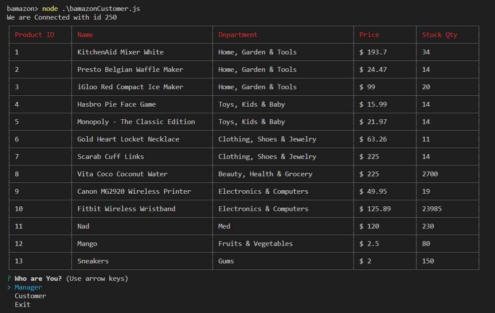
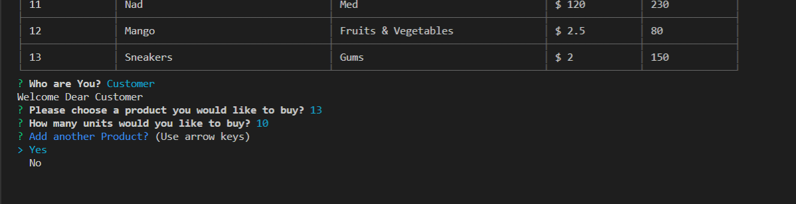
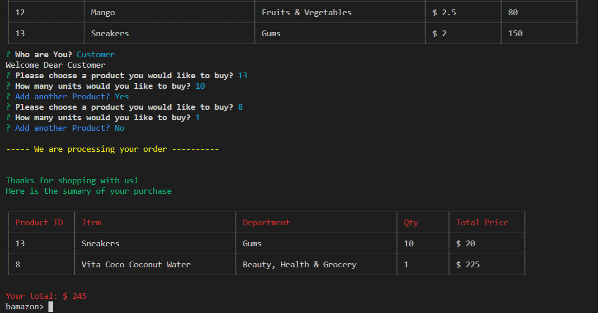
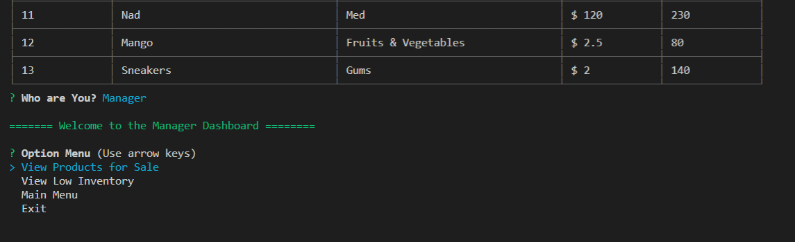
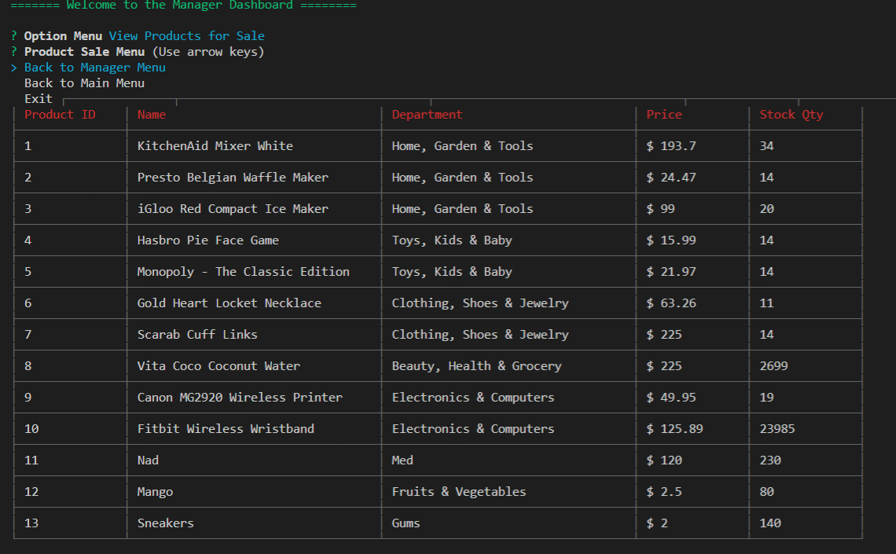
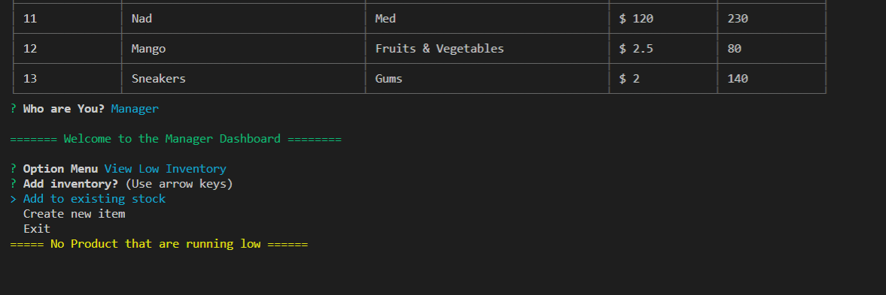
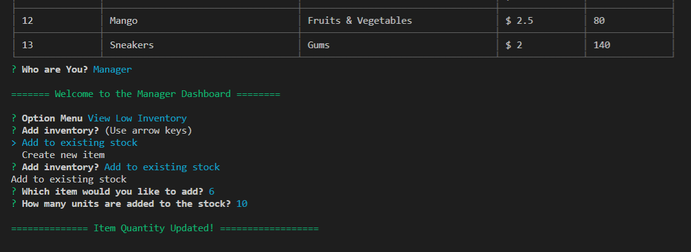
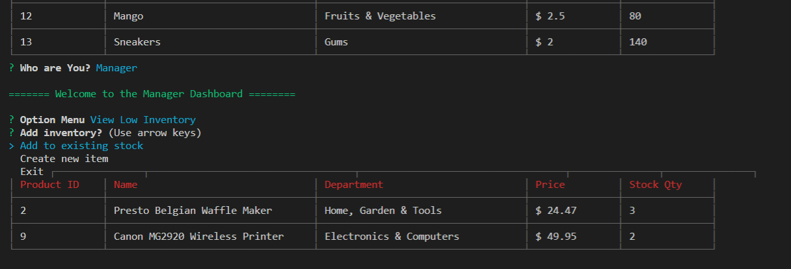
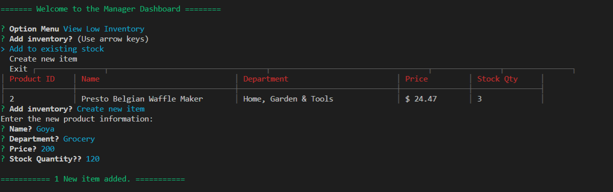

# Welcome To BAMAZON

### Overview

Welcome to Bamazon! This is an Amazon-like storefront built with MySQL and Node.js. 

Within the customer portal, you can view the inventory, choose an item you'd like to purchase
along with the quantity, and voila! Transaction complete! However, if we do not have enough 
of the selected item in stock deeming us unable to fulfill your purchase, the transaction 
will not go through.

Within the manager portal, you can view all inventory in the store, view all low
inventory (less than 5 items in stock), choose to up the inventory back to the correct amount
needed, and even add new items to your inventory! 

### BAMAZON in action

### Want to Try? 

**1.** Clone the repository
**2.** Run npm install, all the required packages will be install:
**3.** Create a .env file in the same directory as the rest of the files. In the .env file should be:
~~~~
DB_HOSTNAME=""
DB_USERNAME=""
DB_PASSWORD=""
DB_NAME=""
~~~~

### BAMAZON Available functions

* Customer can purchase products directly
* Manager can manage the stock

#### Functionality Details

**1. Customer Interface**

The customer interface allows the user to view the current inventory of store items: item IDs, descriptions, department in which the item is located and price. The user is then able to purchase one of the existing items by entering the item ID and the desired quantity. If the selected quantity is currently in stock, the user's order is fulfilled, displaying the total purchase price and updating the store database. If the desired quantity is not available, the user is prompted to modify their order.

**2. Manager Interface**

The manager interface presents a list of four options, as below.

~~~
? Please select an option: (Use arrow keys)
❯ View Products for Sale 
  View Low Inventory 
~~~

The View Products for Sale option allows the user to view the current inventory of store items: item IDs, descriptions, department in which the item is located, price, and the quantity available in stock.

The View Low Inventory option shows the user the items which currently have fewer than 100 units available.

The Add to Inventory option allows the user to select a given item ID and add additional inventory to the target item.

The Add New Product option allows the user to enter details about a new product which will be entered into the database upon completion of the form.

### Screenshot

#### Requests and Results handling

**Customer Dashboard**: When Customers buy Products 

**Manager Dashboard**: When Manager Manage the Products Stocks 

### Technologies Used

* Javascript
* Node.js
* Node packages:
    * [Myql](https://www.npmjs.com/package/mysql)
    * [Inquirer](https://www.npmjs.com/package/inquirer) 
    * [DotEnv](https://www.npmjs.com/package/dot-env)
    * [Colors](https://www.npmjs.com/package/colors)
    * [nodemon](https://www.npmjs.com/package/nodemon)
* GitHub
